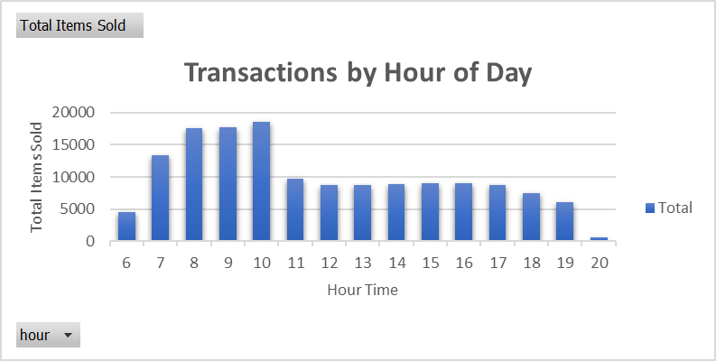
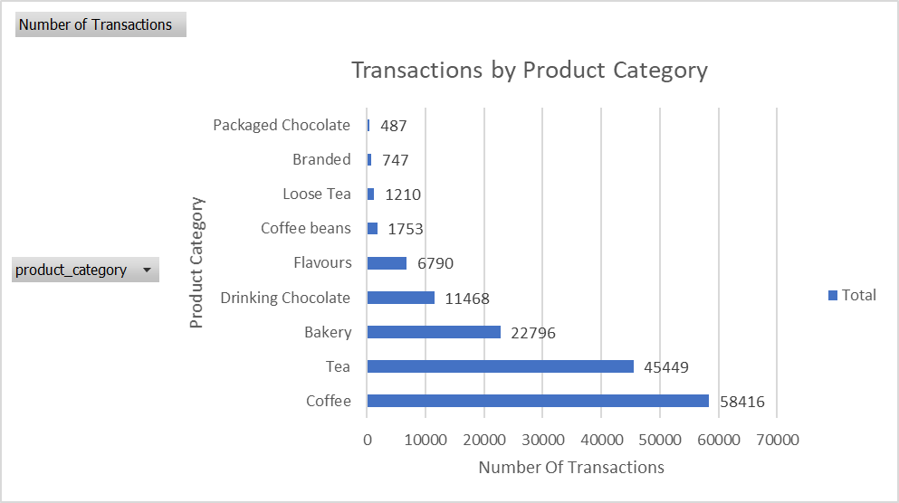
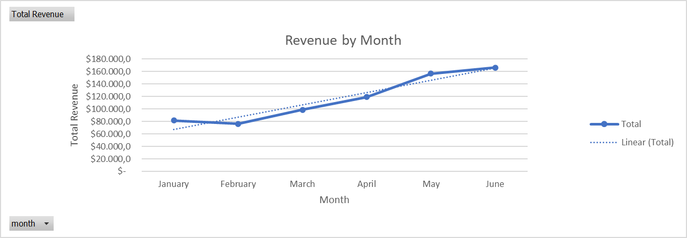

# ☕ Coffee Shop Sales Dashboard  
**Build an interactive dashboard to explore and analyze coffee shop sales**  
[🔗 Maven Analytics Guided Project](https://app.mavenanalytics.io/guided-projects/72ec0a0d-bc7d-4ac4-a8da-da811f9061d6/)

---

## 📂 Download file dashboard
**Build an interactive dashboard to explore and analyze coffee shop sales**  
[Coffe Shop Sales.xlsx](https://drive.google.com/drive/folders/1LMCL1VGMM7uuoPbjp1MFFHZqQwsEeUCJ?usp=drive_link)

---

## 📖 Project Overview
Proyek ini merupakan bagian dari **Maven Analytics Guided Projects**, yang berfokus pada pembuatan **dashboard interaktif untuk menganalisis penjualan toko kopi**.  
Tujuannya adalah untuk membantu pemilik toko memahami tren penjualan, waktu tersibuk, dan produk terlaris guna meningkatkan strategi operasional.

---

## 🎯 Objectives & Tasks

### 🧩 Objective 1: Prepare the Data for Analysis
Menyiapkan dan membersihkan dataset sebelum analisis dilakukan.  

**Langkah-langkah yang dilakukan:**
- Melakukan eksplorasi awal dataset untuk memahami jumlah transaksi dan rentang waktu data.  
- Menambahkan kolom **Revenue** = `Price * Quantity`.  
- Membuat kolom baru untuk **Month** dan **Day of Week** berdasarkan tanggal transaksi.  
  - Ditampilkan dalam format teks seperti “Jan”, “Feb”, “Sun”, “Mon”.  
- Menambahkan kolom **Hour** untuk menunjukkan jam transaksi.  

---

### 📊 Objective 2: Explore the Data with Pivot Tables
Menganalisis data menggunakan **Excel PivotTables** untuk menemukan pola dan tren utama.

**Analisis yang dilakukan:**
- **Revenue by Month** – melihat tren pendapatan bulanan.  
- **Transactions by Day of Week & Hour of Day** – memahami pola aktivitas pelanggan berdasarkan hari dan jam.  
- **Transactions by Product Category** – menemukan kategori produk paling populer.  
- **Top 15 Product Types** – menampilkan 15 produk terlaris berdasarkan jumlah transaksi dan pendapatan.  

---

### 📈 Objective 3: Build a Dynamic Dashboard
Mendesain **dashboard interaktif** dengan kombinasi PivotCharts dan Slicer untuk analisis dinamis.

**Fitur dashboard:**
- **Line Chart**: Revenue per Month  
- **Column Charts**: Transactions by Day of Week & Hour of Day  
- **Bar Chart**: Transactions by Product Category  
- **Table View**: Top 15 Product Types (by transactions & revenue)  
- **Slicer**: Filter berdasarkan **Store Location**  

**Desain tambahan:**
- Menyembunyikan tabel mentah dan gridlines untuk tampilan yang bersih.  
- Menata tata letak dan format visual agar mudah dibaca.  

---

## 📸 Preview Visualisasi

  
  

  
  

---

## 💡 Insights & Recommendations
Beberapa pola menarik yang ditemukan dari dashboard:  
- **Waktu tersibuk** terjadi pada pagi hari pada pukul 7 sampai 10 pagi dan akhir pekan pada hari jumat — menandakan tingginya permintaan kopi untuk aktivitas pagi.  
- **Produk minuman kopi** menduduki nomer satu sebagai kategori minuman yang banyak dibeli dengan transaksi sebanyak 58.416 disusul oleh **Produk minuman tea** yang menduduki peringkat kedua dengan jumlah transaksi sebanyak 45.449.  
- **Trend Penjualan sempat menurun** pada bulan januari ke febuari namun penurunan tidak derastis dan setelah bulan berikutnya mengalami kenaikan yang stabil sampai bulan juni.  

**Rekomendasi:**
- Fokus pada stok dan promosi di **jam sibuk** dan **hari akhir pekan**.  
- Pertimbangkan **menu musiman** atau **diskon pagi hari** untuk meningkatkan penjualan.  
- Perluasan varian minuman populer di lokasi dengan performa tinggi.

---

## 🛠️ Tools & Technologies
- **Microsoft Excel**  
- PivotTable & PivotChart  
- Data Cleaning & Calculation Columns  
- Slicer for interactivity  

---

## ✍️ Author
**ricki309**  
📫 [LinkedIn](https://www.linkedin.com) | [GitHub](https://github.com/ricki309)  
> *Kode proyek bersifat privat. Repository ini hanya berisi dokumentasi dan deskripsi proyek untuk portofolio.*

